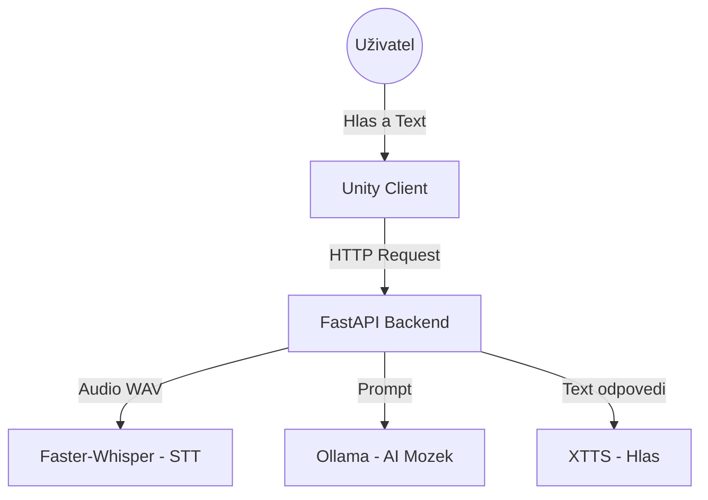

# AI - Voice Assistant

**AI Assistant** je pokročilý hlasový asistent, jehož backend běží lokálně v Dockeru. Projekt kombinuje moderní LLM pro generování textu, neurální sítě pro syntézu řeči a rozpoznávání hlasu s interaktivním 3D avatarem v Unity.

Cílem projektu je vytvořit konverzačního partnera s **nízkou latencí**, **českým jazykem** a **vyjádřením emocí**.

## Funkce 

* **LLM :** Lokální LLM běžící v **Ollama** (např. `llama3.1:latest` podle `.env`).
* **Hlas (TTS):** Real-time syntéza hlasu pomocí lokální služby **XTTS** (HTTP API).
* **Speech-to-text (STT):** Rychlý přepis řeči pomocí **Faster-Whisper** běžícího lokálně.
* **Asynchronní jádro:** Backend postavený na **FastAPI** s plnou podporou `async/await` pro paralelní zpracování více uživatelů.
* **Unity Frontend:** 3D Avatar s lip-syncem (synchronizace rtů) a animacemi podle emocí z textu.

## Technologie

### Backend
* Python, FastAPI, Uvicorn
* **uv** (moderní package manager)

### AI modely (tato větev – lokální)
* **LLM:** model v Ollama (např. `llama3.1:latest`)
* **TTS:** XTTS (běžící jako samostatná služba, viz `TTS_API_URL`)
* **STT:** Faster-Whisper (medium)

### Infrastruktura
* Docker, Docker Compose
* NVIDIA CUDA 11.8/12.x

### Frontend
* Unity 2022+ (C#)
###  Architektura projektu



## Ukázka 

    
---

## Spuštění

### Požadavky
* **NVIDIA GPU** (Doporučeno min. 8GB VRAM).
* **Docker & Docker Compose**.

## Struktura projektu
```
├── Backend/
│   ├── api/
│   │   ├── src/                  
│   │   │   ├── models/           # Pydantic schémata a datové modely
│   │   │   ├── controllers.py    # Hlavní logika (propojení TTS, STT, LLM)
│   │   │   ├── main.py           # Vstupní bod serveru (FastAPI app)
│   │   │   ├── routers.py        # Definice API endpointů
│   │   │   └── chat_history.json # Ukládání historie konverzace
│   │
│   ├── docker/                   # Dockerfiles
│   │
│   ├── makefile                  # Příkazy pro snadné spouštění
│   ├── pyproject.toml            # Definice projektu a závislostí
│   └── uv.lock                   # Uzamčené verze python balíčků (uv)
│
└── UnityClient/                  # Frontend (Unity 3D projekt)
```

V kořenovém adresáři `Backend` vytvořte soubor `.env` (nejjednodušší je zkopírovat připravený `.env_example`).

PowerShell:
```powershell
cd .\Backend\
Copy-Item .env_example .env
```
Do `.env` souboru bude potřeba doplnit hodnoty pro lokální služby (dle tvého prostředí):

**Lokální konfigurace (tato větev):**

- `OLLAMA_HOST` – URL na Ollama server 
- `OLLAMA_MODEL` – název modelu v Ollama (např. `llama3.1:latest`)
- `TTS_API_URL` – URL na XTTS server
- `XTTS_LANGUAGE` – jazyk, typicky `cs`
- `VOICE_ID_AI` – cesta k referenčnímu audio souboru pro AI hlas
- `VOICE_ID_PLAYER` – cesta k referenčnímu audio souboru pro hlas hráče
- `WHISPER_API_URL` – URL na Faster-Whisper server
- `WHISPER_MODEL_SIZE` – velikost modelu (např. `medium`)


#### Spuštění backendu
```{bash}
cd .\Backend\
make dev
```

Tím se spustí

- **API** na portu `8000`

#### API Endpoints

- `POST /tts` - Dostane text, který následně vrátí jako audio stream (WAV).
- `POST /stt_file` - Převod nahraného audio souboru na text (Whisper/Faster-Whisper).
- `GET /get_history` - Výpis historie konverzace.  
- `DELETE /delete_history` - Smazání historie.  
- `POST /chat_realtime` - Realtime komunikace mezi uživatelem a AI pomocí binárního audio streamu (Unity klient).  
- `POST /stop_chat` - Zastaví AI generaci.
