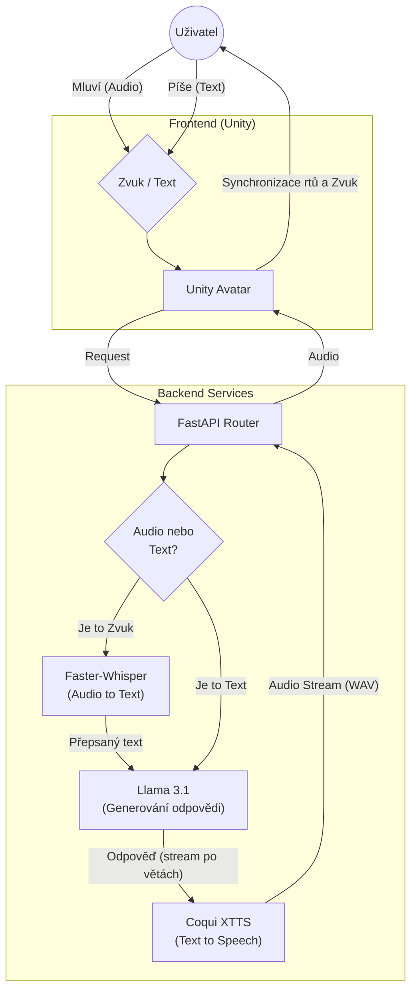

# AI - Voice Assistant

**AI Assistant** je pokročilý hlasový asistent běžící kompletně lokálně (bez cloudu). Projekt kombinuje moderní LLM pro generování textu, neurální sítě pro syntézu řeči (TTS) a rozpoznávání hlasu (STT) s interaktivním 3D avatarem v Unity.

Cílem projektu je vytvořit konverzačního partnera s **nízkou latencí**, **českým jazykem** a **vyjádřením emocí**.

## Funkce

* **LLM :** Využívá **Llama 3.1** (přes Ollama) pro generování inteligentních odpovědí v češtině.
* **Hlas (TTS):** Real-time syntéza hlasu pomocí **Coqui XTTS v2** (klonování hlasu).
* **Speach to text:** Rychlý přepis řeči pomocí **Faster-Whisper**.
* **Asynchronní Jádro:** Backend postavený na **FastAPI** s plnou podporou `async/await` pro paralelní zpracování více uživatelů.
* **Unity Frontend:** 3D Avatar s lip-syncem (synchronizace rtů) a animacemi podle emocí z textu.

## Technologie

### Backend
* Python, FastAPI, Uvicorn
* **uv** (moderní package manager)

### AI Modely
* **LLM:** Llama 3.1:latest
* **TTS:** XTTS-v2
* **STT:** Faster-Whisper (Medium)

### Infrastruktura
* Docker, Docker Compose
* NVIDIA CUDA 11.8/12.x

### Frontend
* Unity 2022+ (C#)
###  Architektura projektu



## Ukázka 

    
---

## Spuštění

### Požadavky
* **NVIDIA GPU** (Doporučeno min. 8GB VRAM).
* **Docker & Docker Compose**.
* **Ollama** běžící na hostitelském PC (nebo v kontejneru).

## Struktura projektu
```
├── Backend/
│   ├── api/
│   │   ├── src/                  
│   │   │   ├── models/           # Pydantic schémata a datové modely
│   │   │   ├── controllers.py    # Hlavní logika (propojení TTS, STT, LLM)
│   │   │   ├── main.py           # Vstupní bod serveru (FastAPI app)
│   │   │   ├── routers.py        # Definice API endpointů
│   │   │   └── chat_history.json # Ukládání historie konverzace
│   │   └── whisper_cache/        # Cache pro stažené modely Whisperu
│   │
│   ├── docker/                   # Dockerfiles
│   │
│   ├── makefile                  # Příkazy pro snadné spouštění
│   ├── pyproject.toml            # Definice projektu a závislostí
│   └── uv.lock                   # Uzamčené verze python balíčků (uv)
│
└── UnityClient/                  # Frontend (Unity 3D projekt)
```

Vytvořte soubor `.env` v adresáří backend 
``` 
cd .\Backend\
cp .\.env_example .env
```

#### Spuštění backendu
```{bash}
cd .\Backend\
make dev
```

Tím se spustí

- **API** na portu `8000`

#### API Endpoints

- `POST /tts` - Dostane text který následně vrátí jako audio stream (WAV)
- `POST /stt_file` - Převod hlasu na audio (Whisper)
- `GET /get_history` - Výpis hisotrie  
- `DELETE /delete_history` - Smazání historie  
- `POST /chat_realtime` - Komunikace mezi uživatelem a AI pomocí audio streamu  
