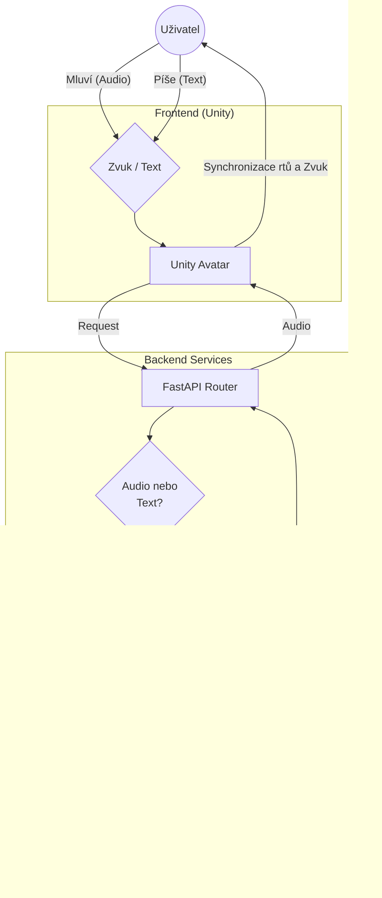

# AI - Voice Assistant

**AI Assistant** je pokročilý hlasový asistent s backendem postaveným na rychlých cloudových API. Projekt kombinuje extrémně rychlé LLM (Groq) pro generování textu, prémiovou syntézu řeči od ElevenLabs (TTS) a lokální rozpoznávání hlasu (STT) s interaktivním 3D avatarem v Unity.

Cílem projektu je vytvořit konverzačního partnera s **minimální latencí**, **přirozeným českým jazykem** a **vyjádřením emocí**.

## Funkce

* **LLM:** Využívá **Groq API** pro bleskové generování inteligentních odpovědí.
* **Hlas (TTS):** Real-time syntéza hlasu pomocí **ElevenLabs API**.
* **Speech to Text:** Rychlý přepis řeči pomocí lokálního **Faster-Whisper**.
* **Asynchronní Jádro:** Backend postavený na **FastAPI** s plnou podporou `async/await` pro paralelní zpracování a efektivní komunikaci s externími API.
* **Unity Frontend:** 3D Avatar s lip-syncem  a animacemi podle emocí z textu.

## Technologie

### Backend
* Python, FastAPI, Uvicorn
* **uv** 

### AI Modely & API
* **LLM:** Groq API (Cloud)
* **TTS:** ElevenLabs API (Cloud)
* **STT:** Faster-Whisper (Lokální)

### Infrastruktura
* Docker, Docker Compose

### Frontend
* Unity 2022+ (C#)

## Architektura projektu



## Ukázka 

    
---

## Spuštění

### Požadavky
* **API Klíče:** Platné API klíče pro **Groq** a **ElevenLabs**.
* **Docker & Docker Compose**.

## Struktura projektu
```text
├── Backend/
│   ├── api/
│   │   ├── src/                  
│   │   │   ├── models/         # Pydantic schémata a datové modely
│   │   │   ├── controllers.py  # Hlavní logika (propojení ElevenLabs, Groq, Whisper)
│   │   │   ├── main.py         # Vstupní bod serveru (FastAPI app)
│   │   │   ├── routers.py      # Definice API endpointů
│   │   │   └── chat_history.json # Ukládání historie konverzace
│   │   └── whisper_cache/      # Cache pro stažené modely lokálního Whisperu
│   │
│   ├── docker/                 # Dockerfiles
│   │
│   ├── makefile                # Příkazy pro snadné spouštění
│   ├── pyproject.toml          # Definice projektu a závislostí
│   └── uv.lock                 # Uzamčené verze python balíčků (uv)
│
└── UnityClient/                # Frontend (Unity 3D projekt)
```

## Konfigurace a spuštění

Než backend poprvé spustíte, musíte mu předat své API klíče. Vytvořte soubor `.env` v adresáři `Backend/`:

```bash
cd ./Backend/
cp .env_example .env
```


#### Spuštění backendu
```bash
make dev
```

Tím se spustí **API** na portu `8000`.

## API Endpoints

- `POST /tts` - Přijme text, který následně vrátí jako audio stream z ElevenLabs (WAV).
- `POST /stt_file` - Převod hlasu na text lokálně pomocí Faster-Whisper.
- `GET /get_history` - Výpis historie konverzace.
- `DELETE /delete_history` - Smazání historie konverzace.
- `POST /chat_realtime` - Komunikace mezi uživatelem a AI (Groq) doplněná o audio stream v reálném čase.